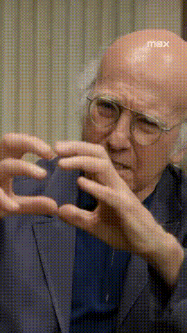

<h2 align="center">Hi 👋, I'm zerone0x</h1>
 
### ┬──┬◡ﾉ(° -°ﾉ)


> Learning anything is never a waste of time.


- 👾 [tryhackme](https://tryhackme.com/p/soberzml)
- 📌 [blog](https://craftship.xyz/)

<!--START_SECTION:waka-->

```txt
From: 04 May 2024 - To: 11 May 2024

Total Time: 16 hrs 44 mins

TypeScript    8 hrs 8 mins    ⣿⣿⣿⣿⣿⣿⣿⣿⣿⣿⣿⣿⣀⣀⣀⣀⣀⣀⣀⣀⣀⣀⣀⣀⣀   47.99 %
Markdown      4 hrs 21 mins   ⣿⣿⣿⣿⣿⣿⣦⣀⣀⣀⣀⣀⣀⣀⣀⣀⣀⣀⣀⣀⣀⣀⣀⣀⣀   25.76 %
JavaScript    1 hr 55 mins    ⣿⣿⣷⣀⣀⣀⣀⣀⣀⣀⣀⣀⣀⣀⣀⣀⣀⣀⣀⣀⣀⣀⣀⣀⣀   11.38 %
Pug           49 mins         ⣿⣄⣀⣀⣀⣀⣀⣀⣀⣀⣀⣀⣀⣀⣀⣀⣀⣀⣀⣀⣀⣀⣀⣀⣀   04.90 %
JSON          46 mins         ⣿⣄⣀⣀⣀⣀⣀⣀⣀⣀⣀⣀⣀⣀⣀⣀⣀⣀⣀⣀⣀⣀⣀⣀⣀   04.61 %
```

<!--END_SECTION:waka-->


[](https://github.com/anuraghazra/github-readme-stats)

<!-- 

 
 -->


<a href="https://leetcode.com/">
  
</a>

<a href="https://www.codewars.com/users/zerone0x">
  
</a>


